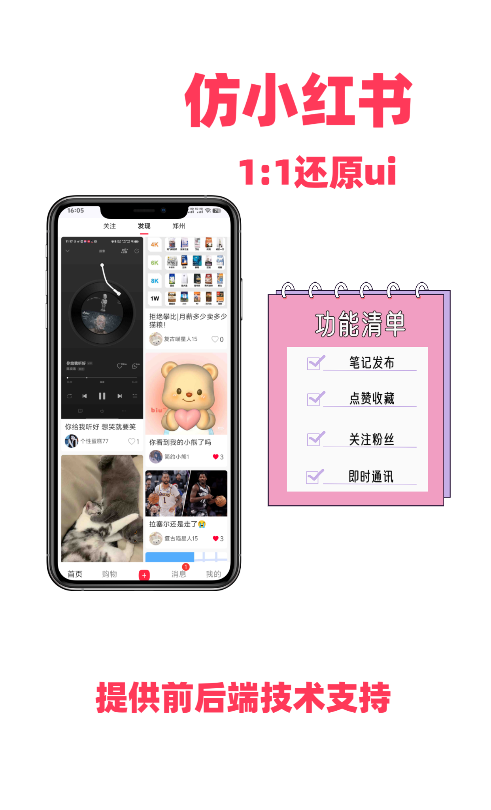
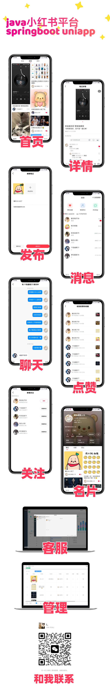
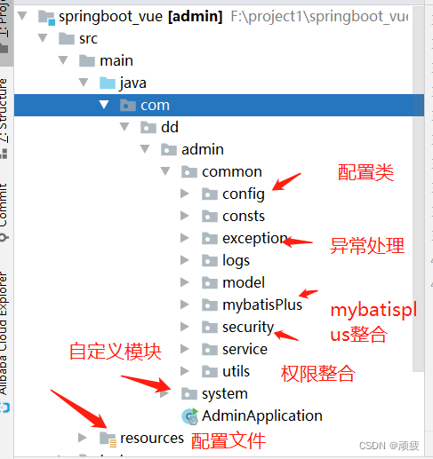

**线上预览:** 

> ### 移动端 **[http://8.146.211.120:8081/](http://8.146.211.120:8081/)**
> ### 管理端 **[http://8.146.211.120:8088/](http://8.146.211.120:8088/)**
小程序 和 app均已适配 


##  qq讨论群: 149100946
## **问题反馈** qq: 727869402 wx: MAMBA_4EVER24

## 更新日志

**🛍️ 2025-01-15**
- ✅ 新增完整商城模块功能
- ✅ 实现商品管理、购物车、订单管理系统
- ✅ 集成用户钱包与余额支付功能
- ✅ 支持收货地址管理与商品评价
- ✅ 完善移动端购物体验与管理端商城后台


**🚀 2025-08-06**
- ✅ 集成七牛云对象存储
- ✅ 支持本地存储、MinIO、七牛云三种存储模式切换


**🎯 2025-08-05**
- ✅ 更新了回复支持图片功能
- ✅ 聊天可以发送图片和视频
- 🔧 优化了多媒体消息的展示逻辑

**🔧 2025-08-01**
- ✅ 完成MinIO配置
- ✅ 实现本地存储和MinIO存储切换
- ✅ 完成阿里云验证码集成
- 🛠️ 优化了文件上传机制

---

### 📖 项目介绍

小红书凭借优秀的产品体验 和超高人气 目前成为笔记类产品佼佼者
此项目将详细介绍如何使用Vue.js和Spring Boot 集合uniapp 
开发一个仿小红书的城应用，凭借uniapp 可以在h5 小程序 app等多端使用


**技术栈**

**移动端** uniapp graceui
**管理端** vue element
**后台** springboot springsecurity mybatisPlus tio-websocket

**主要功能**
- 笔记创建 编辑 发布
- 点赞笔记、评论
- 回复笔记、评论
- 私信、客服聊天
- 后台笔记编辑 下架
- 后台博主冻结
- 后台客服系统
- 系统消息维护
## 思维导图
.png)
## 项目展示

## 项目启动

**后台运行环境**
- jdk1.8
- mysql5.7
- redis

**启动步骤**
1.下载pom文件依赖
2.导入项目中的sql
3.修改yml参数（端口号 数据库名）
4.如果 mysql 报错 order by和group by 执行sql报错sql_mode=only_full_group_by问题解决
```language
SELECT @@GLOBAL.sql_mode;
SELECT @@SESSION.sql_mode;

set @@GLOBAL.sql_mode='STRICT_TRANS_TABLES,NO_ZERO_IN_DATE,NO_ZERO_DATE,ERROR_FOR_DIVISION_BY_ZERO,NO_ENGINE_SUBSTITUTION';
set @@SESSION.sql_mode='STRICT_TRANS_TABLES,NO_ZERO_IN_DATE,NO_ZERO_DATE,ERROR_FOR_DIVISION_BY_ZERO,NO_ENGINE_SUBSTITUTION';

FLUSH PRIVILEGES;
```
5.打包 mvn clean package -Dmaven.test.skip=true 打包后jar文件可以正常运行

**管理端前台运行环境**
- node v14.21.3
- elementui 2.15.14
- vue 2.6.14

**启动步骤**
1.cd 根目录的web文件夹下 
2.执行npm install下载依赖
3.执行npm run dev启动
4.修改.env.xx修改测试环境和正式环境端口
5.npm run build进行打包
6.如果出现lemon imui 依赖报错 解压根目录下dist.rar文件夹到lemon imui根目录下即可 \springboot_vue_xhs\web\node_modules\lemon-imui\dist  
参考 [https://gitee.com/june000/lemon-im/issues/I8ZFRB](https://gitee.com/june000/lemon-im/issues/I8ZFRB)

**移动端前台**
hbudiler 3.99
vue 3
移动端前台使用了graceUi6.0 需授权后找我覆盖文件


## 包结构说名
后端

 - 目前后端功能基本能满足我们需求
 - 后续开发建立和system同级目录 进行功能开发即可

## 写到最后
**代码地址** [https://gitee.com/ddeatrr/springboot_vue_xhs](https://gitee.com/ddeatrr/springboot_vue_xhs)
**问题反馈** qq: 727869402 wx: MAMBA_4EVER24 qq讨论群: 149100946

